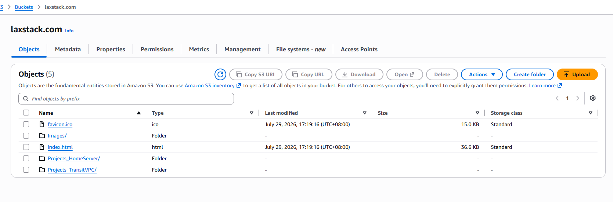
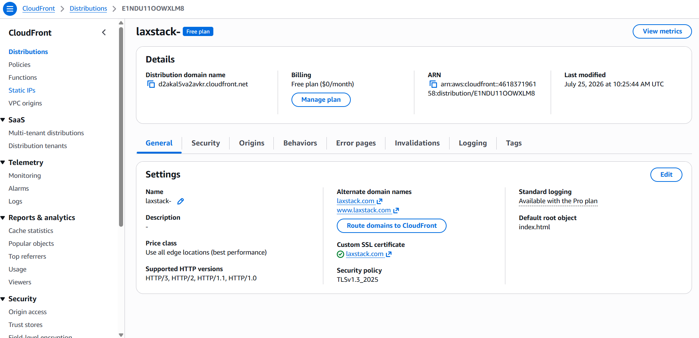
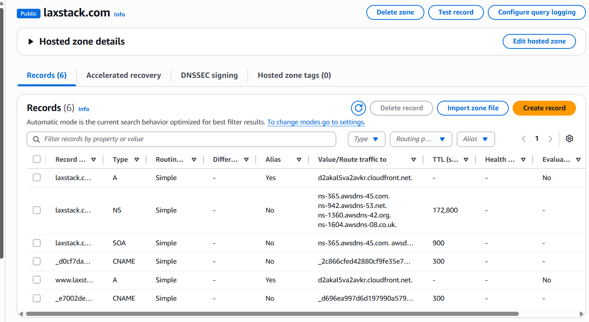
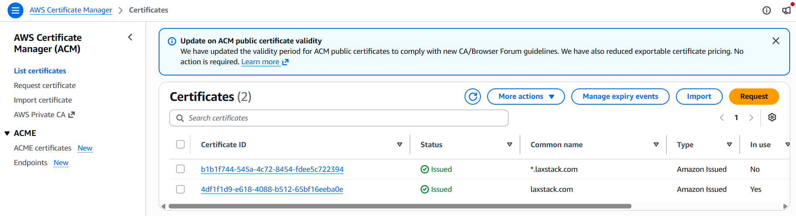
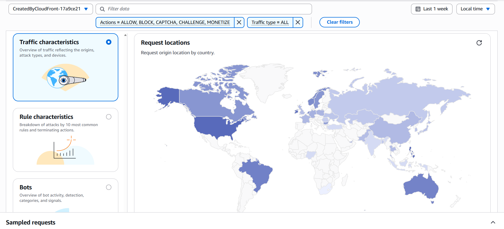
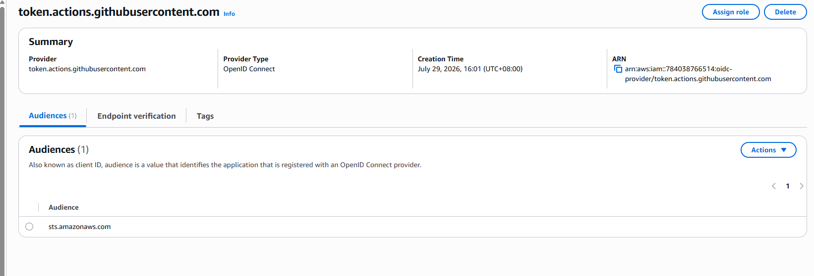
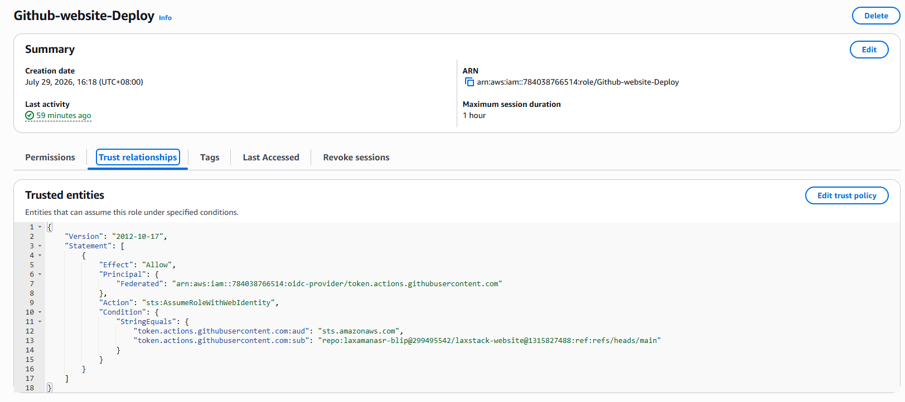
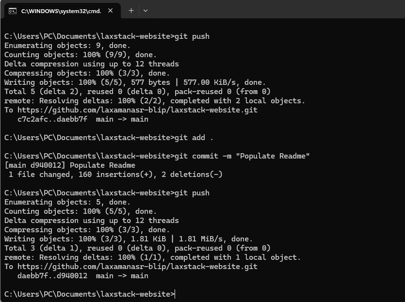

# 🌐 LaxStack Portfolio Website

A cloud-native portfolio website built on **Amazon Web Services (AWS)** to showcase my cloud infrastructure, networking, and automation projects.

The website is hosted using a fully managed serverless architecture powered by **Amazon S3**, accelerated globally with **Amazon CloudFront**, secured using **AWS WAF**, and made accessible through **Amazon Route 53** with HTTPS provided by **AWS Certificate Manager (ACM)**.

To eliminate manual deployments, the project also includes a secure **CI/CD pipeline** built with **GitHub Actions**, **GitHub OpenID Connect (OIDC)**, **AWS IAM**, and **cross-account role assumption**, allowing automated deployments without storing long-lived AWS credentials.

---

# 🌍 Live Website

**https://laxstack.com**

---

# 📖 Project Objectives

This project was built with two primary objectives:

- Build a secure, highly available, serverless portfolio website using AWS managed services.
- Implement a production-style CI/CD pipeline that automates deployments using modern AWS security best practices.

---

# 🏗️ Solution Architecture

The website follows a fully serverless architecture.

```text
                    Internet
                        │
                        ▼
                 Amazon Route 53
                        │
                        ▼
             Amazon CloudFront (CDN)
                        │
                        ▼
                    AWS WAF
                        │
                        ▼
                 Amazon S3 Bucket
```

The website consists entirely of static HTML, CSS, JavaScript, images, and documentation stored in an Amazon S3 bucket.

Rather than exposing the bucket directly to the Internet, requests are served through Amazon CloudFront, providing global edge caching, HTTPS termination, and improved performance.

Route 53 manages DNS for **laxstack.com**, while AWS Certificate Manager provides the SSL certificate used by CloudFront.

AWS WAF protects the application by filtering malicious requests before they reach CloudFront.

---

# ☁️ Website Infrastructure

## Amazon S3

Amazon S3 serves as the origin for the website.

### Responsibilities

- Static website hosting
- Object storage
- Highly durable storage
- Origin for CloudFront



---

## Amazon CloudFront

CloudFront distributes website content globally through AWS edge locations.

### Responsibilities

- Global Content Delivery Network (CDN)
- HTTPS termination
- Edge caching
- Lower latency
- Improved performance



---

## Amazon Route 53

Route 53 provides authoritative DNS for the website domain.

### Responsibilities

- Domain resolution
- Alias record pointing to CloudFront
- Highly available DNS service



---

## AWS Certificate Manager (ACM)

ACM provides and automatically renews the SSL/TLS certificate used by CloudFront.

### Responsibilities

- HTTPS
- SSL certificate management
- Automatic renewal



---

## AWS WAF

AWS WAF protects the application from common web attacks before requests reach CloudFront.

### Responsibilities

- Managed rule groups
- Protection against common exploits
- Request filtering
- Additional security layer



---

# 🚀 Deployment Automation

Once the website infrastructure was completed, the next objective was eliminating manual deployments.

Initially, every website update required:

- Manually uploading files to Amazon S3
- Manually creating CloudFront invalidations
- Waiting for CloudFront to refresh cached content

Although this works for small projects, it is repetitive, error-prone, and does not reflect how production cloud environments are managed.

To solve this problem, I implemented a secure CI/CD pipeline using GitHub Actions and AWS Identity Federation.

---

# ⚙️ CI/CD Architecture

```text
                Developer
                    │
              git add .
              git commit
              git push
                    │
                    ▼
             GitHub Repository
                    │
                    ▼
            GitHub Actions Runner
                    │
                    ▼
        GitHub OpenID Connect (OIDC)
                    │
                    ▼
        AWS Security Token Service
                    │
                    ▼
      Github-website-Deploy Role
          (Free AWS Account)
                    │
                    ▼
           Amazon S3 Deployment
                    │
            AssumeRole (STS)
                    │
                    ▼
     Cloudfront-Invalidation Role
          (Paid AWS Account)
                    │
                    ▼
     Amazon CloudFront Invalidation
                    │
                    ▼
             Updated Website
```

---

# 🔄 Deployment Workflow

A deployment consists of the following steps:

1. Developer commits code locally.
2. Changes are pushed to GitHub.
3. GitHub Actions is triggered manually using **Run workflow**.
4. GitHub authenticates to AWS using OpenID Connect (OIDC).
5. AWS Security Token Service (STS) issues temporary credentials.
6. Website files are synchronized to Amazon S3.
7. GitHub assumes a cross-account IAM role.
8. CloudFront cache is invalidated.
9. Visitors receive the latest version of the website.

---

# 🔐 Secure Authentication using GitHub OIDC

Instead of storing AWS Access Keys inside GitHub Secrets, this project uses GitHub OpenID Connect.

This allows GitHub to authenticate directly with AWS and receive temporary credentials from AWS Security Token Service (STS).

### Benefits

- No long-lived AWS credentials
- Temporary credentials
- Reduced credential management
- AWS recommended deployment method
- Improved security posture



---

# 🔄 Cross-Account Deployment

The deployment spans two AWS accounts.

## Free AWS Account

Responsible for:

- GitHub OIDC Authentication
- Website Deployment
- Amazon S3

IAM Role

```
Github-website-Deploy
```

Permissions

- s3:ListBucket
- s3:GetObject
- s3:PutObject
- s3:DeleteObject
- sts:AssumeRole

---

## Paid AWS Account

Responsible for:

- Amazon CloudFront
- AWS WAF

IAM Role

```
Cloudfront-Invalidation
```

Permissions

- cloudfront:CreateInvalidation

The Paid AWS Account trusts only the deployment role from the Free AWS Account, enabling secure cross-account role assumption.



---

# 📝 Git Workflow

The deployment starts with a standard Git workflow.

```bash
git add .
git commit -m "Update website"
git push
```

The workflow is triggered manually through GitHub Actions, allowing multiple commits before deploying the latest version.



---

# 🛡️ Security Highlights

- GitHub OpenID Connect (OIDC)
- Temporary AWS STS Credentials
- Least Privilege IAM Policies
- Cross-Account IAM Role Assumption
- AWS WAF Protection
- HTTPS using ACM
- Zero Stored AWS Access Keys

---

# 🧰 Technologies Used

| Category | Technology |
|-----------|------------|
| Frontend | HTML, CSS, JavaScript |
| Version Control | Git, GitHub |
| CI/CD | GitHub Actions |
| Authentication | GitHub OIDC |
| Cloud | Amazon Web Services |
| Storage | Amazon S3 |
| CDN | Amazon CloudFront |
| DNS | Amazon Route 53 |
| Security | AWS IAM, AWS STS, AWS WAF |
| TLS | AWS Certificate Manager |

---

# 📚 Lessons Learned

Building this project provided hands-on experience with:

- Static website hosting on Amazon S3
- Content delivery using Amazon CloudFront
- DNS management with Route 53
- HTTPS using ACM
- Web application protection with AWS WAF
- GitHub Actions automation
- OpenID Connect (OIDC)
- AWS Security Token Service (STS)
- IAM Trust Policies
- IAM Permission Policies
- Cross-account IAM role assumption
- CloudFront cache invalidation
- Secure CI/CD design

One of the most valuable lessons was troubleshooting GitHub OIDC authentication by decoding the JWT claims and identifying a trust policy mismatch caused by GitHub's newer subject claim format.

---

# 🚀 Future Improvements

Planned enhancements include:

- Infrastructure as Code using Terraform
- AWS CDK implementation
- Separate Development and Production environments
- Automated HTML validation
- Lighthouse performance testing
- Slack / Microsoft Teams deployment notifications
- Automated security scanning

---

# 👨‍💻 Author

**Sidney Leigh Laxamana**

Cloud Infrastructure Engineer

- AWS
- Cloud Infrastructure
- Networking
- Hybrid Cloud
- SD-WAN
- Infrastructure Automation